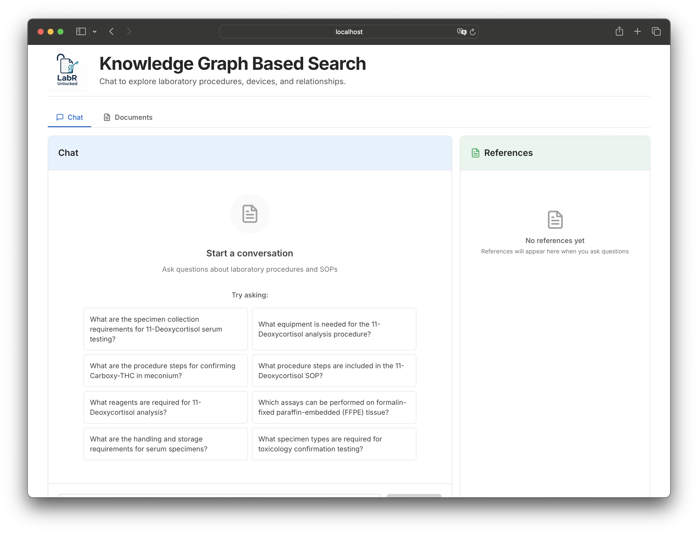
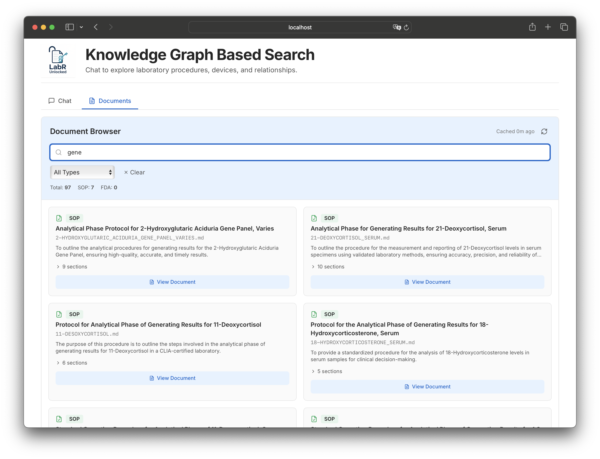
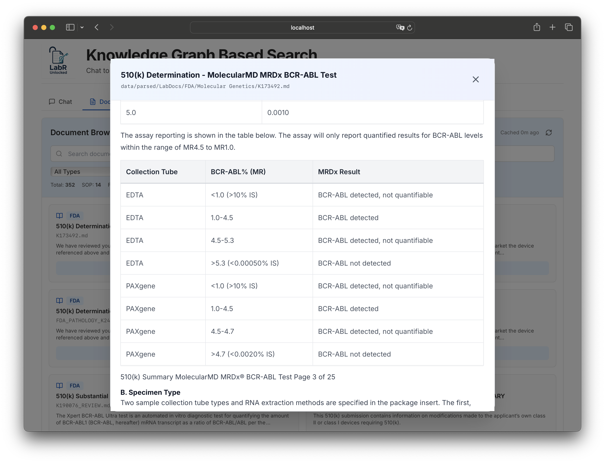
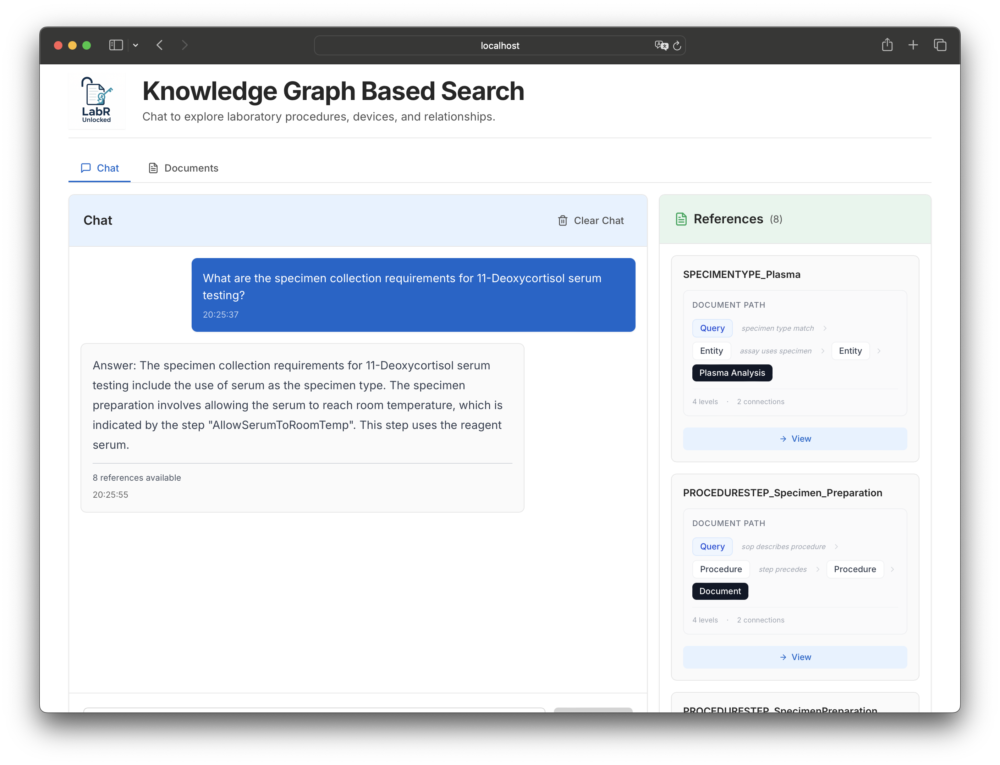
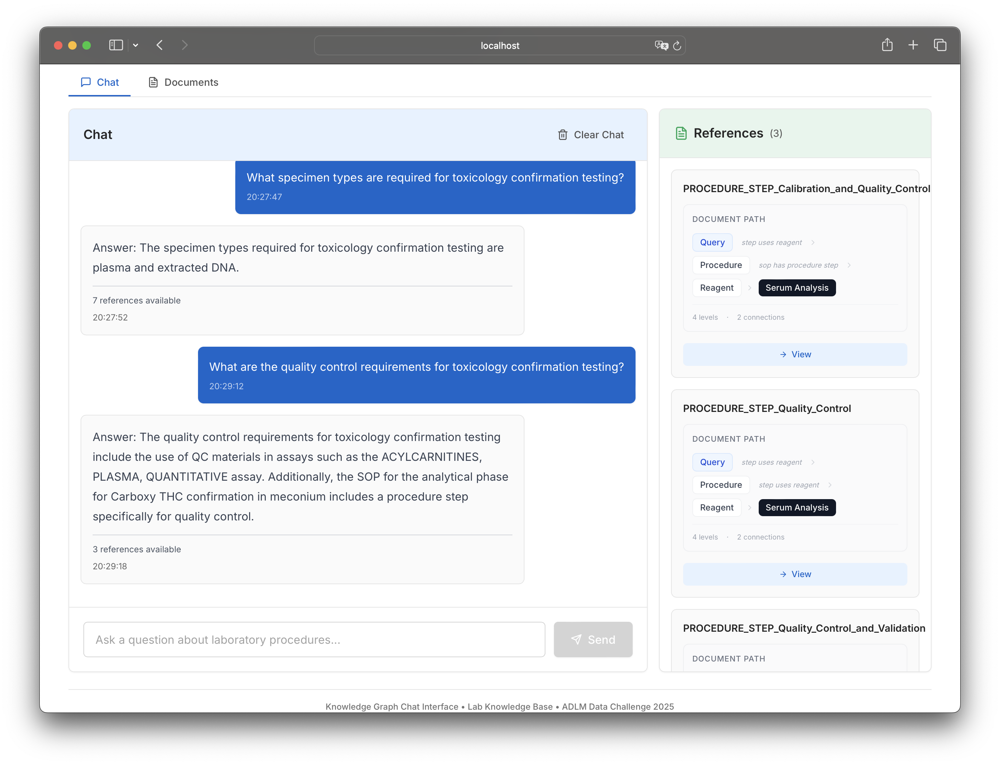

# LabDocs Unlocked - LabR Solution


**Submission for the 2025 ADLM Data Science Challenge**

This repository contains **LabR's** solution to the ADLM 2025 Data Science Challenge: developing an AI-powered tool for extracting and querying information from laboratory documentation using knowledge graphs.

> [!info]
> **About the Challenge**: The 2025 ADLM Data Science Challenge seeks to address the challenge of navigating vast amounts of laboratory documentation by leveraging AI to create a tool capable of quickly and accurately extracting and presenting user-requested information. For more details about the challenge, scoring criteria, and timeline, visit the [official challenge repository](https://github.com/cesargm2015/ADLM-2025-Data-Challenge).

---

## Quick Start

Transform laboratory documents into a knowledge graph to enable natural language querying, semantic search, and interactive exploration of complex regulatory and procedural information.

### Prerequisites

Before diving in, ensure you have:
- **Neo4j server access** (running instance or Docker container)
- **Python 3.11+** installed
- **uv** package manager ([installation guide](https://github.com/astral-sh/uv))
- **AWS credentials** configured (for Bedrock LLM and embeddings)
- **OpenRouter API key** (optional, for PDF parsing if processing from scratch)

> [!note]
> **OS Compatibility**: This solution has been tested on recent macOS and Debian-based Linux distributions. Windows support is not guaranteed.

### 5-Minute Setup

Get the web interface running in just a few steps:

1. **Clone the repository**
   ```bash
   git clone https://github.com/cesargm2015/ADLM-2025-Data-Challenge.git
   cd ADLM-2025-Data-Challenge
   ```

2. **Install dependencies**
   ```bash
   uv sync
   ```

3. **Configure environment**
   Create a `.env` file in the project root with:
   ```bash
   # Neo4j Connection
   NEO4J_URI=bolt://localhost:7687
   NEO4J_USER=neo4j
   NEO4J_PASSWORD=your_password
   NEO4J_DATABASE=labdocs_kg
   
   # AWS Credentials
   AWS_PROFILE=your_aws_profile
   AWS_REGION=us-east-1
   BEDROCK_MODEL_ID=ai21.jamba-1-5-large-v1:0
   
   # OpenRouter (if processing PDFs)
   OPENROUTER_API_KEY=your_key_here
   ```

4. **Get the data** (choose one path):
   - **Quick**: Download pre-processed artifacts from [Pre-processed Artifacts](#pre-processed-artifacts-optional) section
   - **Full**: Process documents from scratch following [HOWTO.md](./docs/HOWTO.md)

5. **Load into Neo4j** (if using pre-processed artifacts)
   ```bash
   uv run python pipelines/kg_pipeline/02_load.py --extraction-dir ./graphdb_unified/extractions
   ```

6. **Start the application**
   ```bash
   ./start.sh
   ```
   This starts the Flask API (port 5001) and React frontend (port 3001) automatically.

7. **Open your browser**
   Navigate to `http://localhost:3001` and start querying!

### What You'll Get

Once running, you'll have access to:
- **Interactive chat interface** for natural language queries
- **Knowledge graph visualization** showing entity relationships
- **Document references** with links to source sections
- **Semantic search** powered by entity embeddings
- **Context-aware answers** synthesized from the knowledge graph

#### Screenshots

**Query Input Interface**


**Query Results with LLM Answer**


**Interactive Knowledge Graph Visualization**


**Document Browser & References**


**Conversation History & Multi-turn Chat**


### Next Steps

For a deeper understanding of the complete pipeline—from PDF parsing to knowledge graph extraction—see the comprehensive [HOWTO.md](./docs/HOWTO.md) guide.

---

## Team Information

**Team Name**: LabR
**Contact**: [cesar.miguel@einstein.br](mailto:cesar.miguel@einstein.br)

**Team Members**:
- Cesar Gomes Miguel
- Tatiana Ferreira de Almeida
- Luisane Vieira

---

## Solution Overview

Our solution transforms laboratory documents (PDFs) into a queryable knowledge graph using a multi-stage pipeline:

1. **PDF Parsing**: Converts PDF documents to structured Markdown using LLM-based parsing
2. **Knowledge Graph Extraction**: Extracts entities and relationships using AWS Bedrock LLM
3. **Graph Loading**: Loads extracted data into Neo4j with entity deduplication and embedding generation
4. **Query Interface**: Provides natural language querying through a React frontend and Flask API

### Features

- Combines SOP procedures and FDA regulatory documents in a single Knowledge Graph (KG)
- Semantic similarity search
- Neo4j Cypher queries retrieve relationships and context from the KG based on user's input. 
- Answers include citations and links to source documents

### Architecture

The system architecture consists of:
- **Processing Pipeline**: PDF → Markdown → JSON extractions → Neo4j graph
- **Query Layer**: Semantic search + Graph traversal + LLM synthesis
- **Frontend**: React-based chat interface with graph visualization
- **Backend**: Flask API with knowledge graph query endpoints

For detailed architecture diagrams, see:
- [System Architecture](docs/diagrams/system_architecture.md) - Complete system overview
- [Pipeline Flow](docs/diagrams/pipeline_flow.md) - Knowledge graph extraction pipeline
- [Query Flow](docs/diagrams/query_flow.md) - Query processing flow

---

## Pre-processed Artifacts (Optional)

For evaluators who want to skip the processing steps and get straight to querying, pre-processed artifacts are available for download. These artifacts contain the extracted knowledge graph data and vector embeddings, allowing you to load the system directly into Neo4j without running the full extraction pipeline.

### Available Artifacts

The following pre-processed artifacts are available as compressed archives:

1. **Parsed Markdown Documents** (`parsed_labdocs.md.tar.gz`):
   - Contains 7,681 parsed markdown files from PDF documents (4,457 FDA + 3,224 Procedures)
   - Output of PDF parsing pipeline (Step 1)
   - Size: ~22 MB compressed
   - Download: [Google Drive Folder](https://drive.google.com/drive/folders/1h4iPtTU1n5NtdL4LelXqMSxWDyIkVqi3?usp=sharing) (all 3 .tar.gz files are in this folder)

2. **Knowledge Graph Extractions** (`graphdb_extractions.tar.gz`):
   - Contains 352 JSON files with extracted entities and relationships
   - Output of `01_extract.py` (Step 3a)
   - Ready for loading into Neo4j
   - Size: ~492 KB compressed
   - Download: [Google Drive Folder](https://drive.google.com/drive/folders/1h4iPtTU1n5NtdL4LelXqMSxWDyIkVqi3?usp=sharing) (all 3 .tar.gz files are in this folder)

3. **Entity Vector Store** (`graphdb_vectorstore.tar.gz`):
   - Contains vector embeddings for semantic search over entities
   - Created by `02_load.py` (Step 3b)
   - Required for the knowledge graph query system
   - Size: ~28 MB compressed
   - Download: [Google Drive Folder](https://drive.google.com/drive/folders/1h4iPtTU1n5NtdL4LelXqMSxWDyIkVqi3?usp=sharing) (all 3 .tar.gz files are in this folder)

### Installation Instructions

1. **Download the artifacts** from the [Google Drive folder](https://drive.google.com/drive/folders/1h4iPtTU1n5NtdL4LelXqMSxWDyIkVqi3?usp=sharing) (all 3 .tar.gz files are in this folder)

2. **Extract the downloaded archives** to your project root directory:
   ```bash
   # Extract parsed markdown files (optional, if you want to re-run extraction)
   tar -xzf parsed_labdocs.md.tar.gz
   
   # Extract knowledge graph extractions (required)
   tar -xzf graphdb_extractions.tar.gz
   
   # Extract vector store (required)
   tar -xzf graphdb_vectorstore.tar.gz
   ```

3. **Verify the directory structure**:
   ```
   ./data/parsed/LabDocs/          # Parsed markdown files (if extracted)
   ./graphdb_unified/extractions/  # KG extraction JSON files
   ./graphdb_vectorstore/          # Vector store files
   ```

4. **Ensure your Neo4j database is running and configured** (see [Quick Start](#quick-start) for setup)

5. **Load the artifacts into Neo4j**:
   ```bash
   uv run python pipelines/kg_pipeline/02_load.py --extraction-dir ./graphdb_unified/extractions
   ```
   
   > [!note]
   > The `02_load.py` script will automatically use the existing vector store if it's already present in `./graphdb_vectorstore/`. If you're loading fresh, it will create a new vector store.

> [!note]
> These artifacts are optional. You can still process documents from scratch by following the complete workflow in [HOWTO.md](./docs/HOWTO.md). The pre-processed artifacts are provided to save time during evaluation and testing.

---

## Documentation

Comprehensive documentation is available for different aspects of the solution:

- [**Complete Workflow Guide**](./docs/HOWTO.md) - From PDF parsing to knowledge graph extraction
- [**Extraction Guide**](./docs/EXTRACTION_GUIDE.md) - Unified ontology extraction process
- [**Query Guide**](./docs/UNIFIED_GRAPH_GUIDE.md) - Cypher queries and graph exploration
- [**Quick Start**](./docs/QUICK_START.md) - Quick reference guide

### Architecture Diagrams

Visual representations of the system architecture:
- [**System Architecture**](docs/diagrams/system_architecture.md)
- [**Pipeline Flow**](docs/diagrams/pipeline_flow.md)
- [**Query Flow**](docs/diagrams/query_flow.md)

---

## Project Structure

```
ADLM-2025-development-v3/
├── src/
│   ├── api/              # Flask API endpoints
│   └── labdocs/          # Core modules (parser, graph, prompts)
├── pipelines/
│   ├── kg_pipeline/      # Knowledge graph extraction and loading
│   └── vectordb_pipeline/ # Vector database pipeline (optional)
├── frontend/             # React frontend application
├── docs/
│   ├── diagrams/         # Architecture diagrams
│   └── *.md              # Documentation files (HOWTO, guides, etc.)
├── data/                 # Data directories (raw, parsed)
├── graphdb_unified/      # Knowledge graph extractions
└── graphdb_vectorstore/  # Entity vector store
```

---

## Framework

- **Python 3.11+**: Core programming language
- **Neo4j**: Graph database for knowledge graph storage
- **AWS Bedrock**: LLM and embedding services
- **LlamaIndex**: Framework for knowledge graph operations
- **React**: Frontend framework
- **Flask**: Backend API framework
- **OpenRouter API**: PDF parsing via LLM

---

## Need Help?

For questions about this solution, please contact the team using the contact information in the [Team Information](#team-information) section above.

For questions about the ADLM 2025 Data Science Challenge, please email ahobby@myadlm.org.
