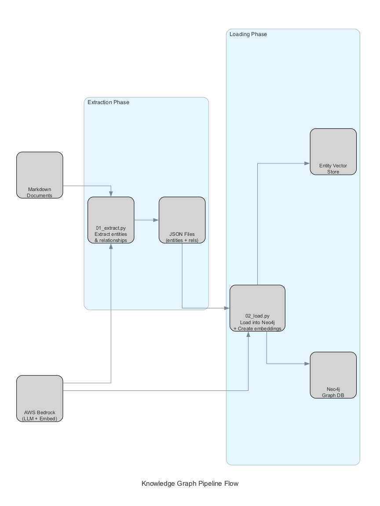

# Knowledge Graph Pipeline Flow

This diagram illustrates the knowledge graph extraction and loading pipeline, showing how documents are processed from markdown format to a queryable graph database.

## Pipeline Stages

### Input
- **Markdown Documents**: Structured markdown files generated from PDF parsing

### Extraction Phase
- **01_extract.py**: Extracts entities and relationships from markdown documents
  - Uses AWS Bedrock LLM to identify entities and their relationships
  - Outputs structured JSON files containing extracted data
  
- **JSON Files**: Intermediate storage of extracted entities and relationships

### Loading Phase
- **02_load.py**: Loads extracted data into Neo4j
  - Creates nodes and edges in the graph database
  - Generates entity embeddings using AWS Bedrock
  - Performs entity deduplication (similarity threshold: 0.85)
  
- **Neo4j Graph DB**: Final graph database with nodes, edges, and properties
- **Entity Vector Store**: Vector embeddings for semantic search

### External Services
- **AWS Bedrock (LLM + Embed)**: Provides both LLM for extraction and embedding models for vector generation

## Flow

1. Markdown documents are processed by `01_extract.py` with Bedrock LLM
2. Extracted entities and relationships are saved as JSON files
3. `02_load.py` reads JSON files and loads them into Neo4j
4. Entity embeddings are created and stored in the vector store
5. The system is ready for querying

