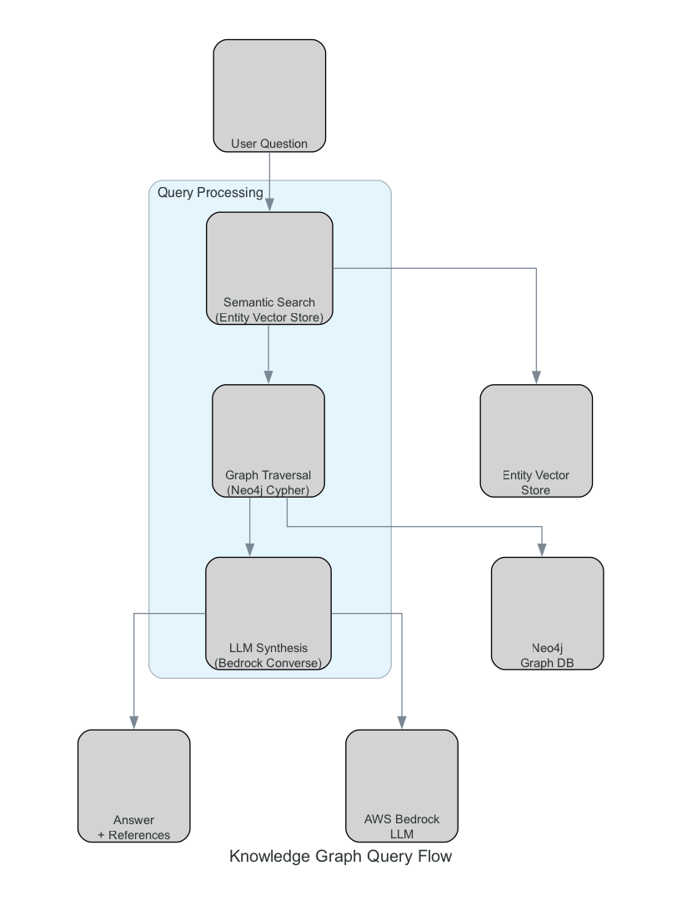

# Knowledge Graph Query Flow

This diagram shows how user queries are processed through the knowledge graph system, from question to answer.

## Query Processing Steps

### 1. User Question
User submits a natural language question through the frontend interface.

### 2. Query Processing

#### Semantic Search
- Searches the Entity Vector Store using query embeddings
- Finds relevant entities based on semantic similarity
- Returns top-k most relevant entities

#### Graph Traversal
- Uses Neo4j Cypher queries to traverse relationships
- Retrieves connected entities and context from the graph
- Builds comprehensive context for the answer

#### Inference
- Combines semantic search results and graph context
- Uses an LLM to generate answer
- Ensures answer is based only on knowledge graph context

### 3. Answer + References
- Returns natural language answer
- Includes document references and source citations

## Flow

1. User question is converted to embedding
2. Semantic search finds relevant entities
3. Graph traversal retrieves relationships and context
4. LLM synthesizes answer from retrieved context
5. Answer with references is returned to user

