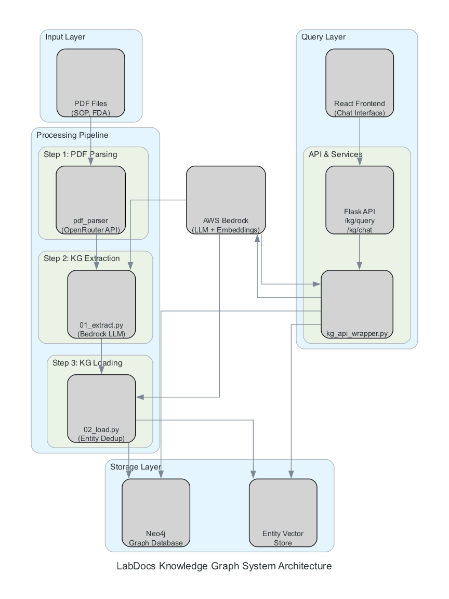

# System Architecture

This diagram shows the complete LabDocs Knowledge Graph system architecture, including all components from input processing to query interfaces.

## Components

### Input Layer
- **PDF Files (SOP, FDA)**: Source documents containing laboratory procedures and regulatory information

### Processing Pipeline
- **Step 1: PDF Parsing** (`pdf_parser`)
  - Converts PDF documents to structured Markdown format
  - Uses OpenRouter API for LLM-based parsing
  
- **Step 2: KG Extraction** (`01_extract.py`)
  - Extracts entities and relationships from markdown documents
  - Uses AWS Bedrock LLM for structured extraction
  
- **Step 3: KG Loading** (`02_load.py`)
  - Loads extracted data into Neo4j graph database
  - Creates entity embeddings for semantic search
  - Performs entity deduplication

### Storage Layer
- **Neo4j Graph Database**: Stores entities, relationships, and graph structure
- **Entity Vector Store**: Stores embeddings for semantic search over entities

### Query Layer
- **API & Services**
  - **Flask API**: REST API endpoints (`/kg/query`, `/kg/chat`, `/kg/context`)
  - **kg_api_wrapper.py**: Core knowledge graph query module
  
- **React Frontend**: Interactive chat interface for querying the knowledge graph

### External Services
- **AWS Bedrock**: Provides LLM and embedding services for extraction and querying

## Data Flow

1. PDF documents are parsed into Markdown format
2. Markdown is processed to extract entities and relationships
3. Extracted data is loaded into Neo4j and vector store
4. User queries flow through Flask API → kg_api_wrapper → Neo4j/Vector Store → Bedrock → Response

