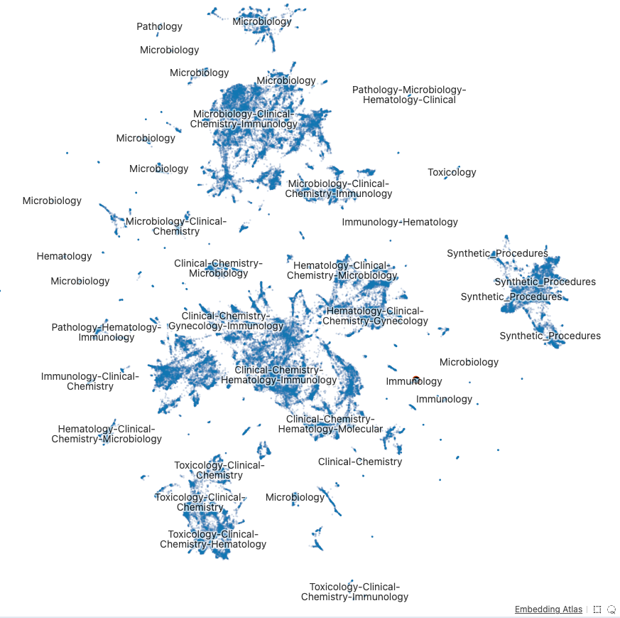

# Retrieval Design

My design is based on the [Contextual Retrieval framework](https://www.anthropic.com/news/contextual-retrieval) put forward by Anthropic.

## Build

### Pre-processing

The application first extracts all documents into a normalized plain-text format. It currently supports plain text (`.txt`, `.md`, `.rst`) and `.pdf` file inputs. It has a 100% success rate converting the LabDocs dataset provided for this challenge. However, LabDocs/FDA/Microbiology/K181029.pdf appears to be an empty file.

Once the text is extracted, it is chunked into smaller pieces (approximately 500 words per chunk). I used the `chonkie.SentenceChunker` algorithm to chunk the documents. It tries to maintain sentence structures in the chunks. I used zero overlap between chunks because chunk context can be established with LLM-generated contextual embeddings. Context is added to each chunk based on its source file. This context comes in two forms:

1. Context derived from the file's path. This is added by expert opinion via the `app/config/chunk_annotation_patterns.yml` file.
2. Context added by an LLM intended to situate the chunk within the overall document. I limited the number of allowed characters in the LLM context to the range of 30 < x < 750.

The contextual embeddings were generated with the following query structure:
```
<document>
{whole_document}
</document>
Here is the chunk we want to situate within the whole document
<chunk>
{chunk_text}
</chunk>
Please give a short succinct context to situate this chunk within the overall document for the purposes of improving search retrieval of the chunk. Answer only with the succinct context and nothing else.
```

After chunking, there are 105,520 text blobs to search through.

There are approximately 50 million tokens in the text corpus after my pre-processing.

#### Challenges during pre-processing
1. Some input PDF files lacked the metadata that allows for fast `fitz`-based text extraction. I had to use an OCR-based imange-text extraction technique for those 73 files.
2. Chunk-context generation costs money and is slow. I used the low-cost Amazon Nova Lite to contextualize the chunks. It has a 300k token context window, which is well above the largest document+chunk size of ~90k tokens (LabDocs/FDA/Microbiology/K191288_REVIEW.pdf). However, the Amazon Nova Lite model's performance significantly degrades for large queries. Some of the documents in this dataset are 400k+ characters. I did an initial pass with Amazon Nova Lite, then found problematic examples and re-generated the context with the more powerful Amazon Nova Pro model. The larger, more expensive models generate much higher quality responses for normal and large queries and have higher behavioral stability.
3. I reviewed the contextual annotations and removed those with low quality (too long, too short, no content, junk tags). Then I re-ran those queries against the more powerful Amazon Nova Pro LLM. The total cost of generating the contextual annotations was approximately $200.

#### Vector Search
Once the chunks are prepared and annotated, I use the `text-embedding-3-large` model to embed the chunks into a vector database with f32 precision. The following figure shows the separation of the embeddings in 3072-dimensional space. It was generated with the `embedding-atlas` library and uses a uniform manifold approximation and projection (UMAP) algorithm to accurately display custers by maintaining local distances.



The figure seems to demonstrate reasonable performance. Most notably, the Synthetic Procedures are clustered away from the other documents, and the FDA files have some evidence of logical clustering.

Vector search speed is entirely dominated by OpenAI network latency. The exact L2 KNN (K=120) calculation takes ~0.1 seconds while the network latency consumes 0.75-1.5 seconds.

#### BM25
To help with exact retrieval and other weaknesses of vector search, I also use classic BM25 search. I am using the BM25Ok algorithm:

$$
score(q, D)=\sum_{t\in q}IDF(t)\frac{f(t,D)(k_{1}+1)}{f(t,D)+k_{1}(1-b+b\frac{|D|}{avgdl})}
$$

$k_{1}$ and $b$ are free parameters, set to the defaults ($b=0.75$, $k_1=1.5$).

I rewrote the Python rank_bm25 library in Rust and achieved 10x index construction speed and 240x search speed. Awesome!

My implementation of BM25 search takes approximately 0.01 seconds with K=120.

#### Rank Fusion
I used [reciprocal rank fusion](https://cormack.uwaterloo.ca/cormacksigir09-rrf.pdf):

$$
RRF(d \in D) = (\frac{1}{60+r_{bm25}(d)})+(\frac{1}{60+r_{vector}(d)})
$$

I retrieve 50 chunks with each algorithm and select the top $k$ chunks based on the Rank Fusion score.

### Query and Retrieval
1. A user inputs a query (question or request)
2. Chunks are retrieved from the VDB via KNN L2 search with FAISS
3. Chunks are retrieved with the BM25 search
4. Use Reciprocal Rank Fusion and take the top $k$ chunks.
5. Add the top $k$ chunks to the user's input as context, and query the LLM to respond to the initial query.

### Performance

I collected these speed statistics with 8 measurements in one testing session. All numbers are in terms of seconds.

| Operation | Model                    | Mean  | $\sigma$ | Price (input/output) 1k tokens |
|:----------|:-------------------------|:------|:---------|:-------------------------------|
| Embed     | `text-embedding-3-large` | 1.21  | 0.49     | 0.00013                        |
| Query     | `amazon-nova-pro:v1`     | 4.01  | 1.32     | 0.0008/0.0032                  |
| Query     | `gpt-5`                  | 50.21 | 15.62    | 0.00125/0.01                   |
| Query     | `gpt-5-mini`             | 15.79 | 3.33     | 0.00025/0.002                  |
| Query     | `gpt-5-nano`             | 22.11 | 10.29    | 0.00005/0.0004                 |


In my experiments, the Amazon Nova Pro, GPT-5, and GPT-5-mini models all yielded similar qualitative response quality. I did not notice any errors in my tests with these models. The GPT-5-Nano model's response quality was very poor. It ignored relevant documents and failed to cite all of its sources.

#### Recommendations
Since the Amazon Nova Pro model is cheaper and faster than GPT-5, and it has similar performance to GPT-5 or GPT-mini, I recommend its use for this application. However, if you don't have access to an Amazon account with access to Amazon Bedrock, I recommend the GPT-5-mini model for balanced speed, accuracy, and cost. If time and cost are not factors, use the GPT-5.

